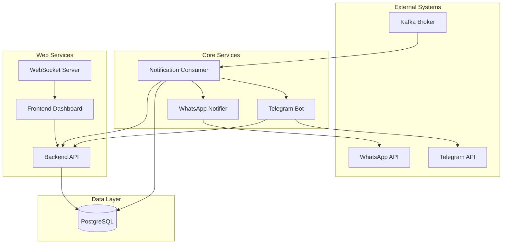

# 🚀 Notification Gateway - Multi-Channel Notification System

A comprehensive, enterprise-grade notification gateway that consumes alarm messages from **Apache Kafka** and broadcasts them as real-time notifications via **Telegram** and **WhatsApp**. This application features a complete web dashboard for user management and is designed for high reliability with PostgreSQL database integration.

## ✨ Key Features

### 🔔 Multi-Channel Notifications

- **Telegram Bot Integration**: Real-time notifications via Telegram with interactive bot commands
- **WhatsApp Integration**: Uses WAHA (WhatsApp HTTP API) for reliable WhatsApp messaging
- **Priority-Based Routing**: Intelligent routing based on alarm priority levels

### 👥 User Management & Preferences

- **Web Dashboard**: Complete React-based frontend for managing notification recipients
- **User Authentication**: Secure JWT-based authentication system
- **Preference Management**: Users can choose notification channels (WhatsApp, Telegram)
- **Role-Based Access**: Different notification classes for different user groups

### 🏗️ Enterprise Architecture

- **Microservices Design**: Modular architecture with separate services
- **Database Integration**: PostgreSQL for persistent data storage
- **Real-time Updates**: WebSocket connections for live dashboard updates
- **Docker Support**: Complete containerization with Docker Compose
- **High Performance**: Async/await patterns and efficient Kafka consumption

### 🔧 Advanced Features

- **Kafka Integration**: Robust message consumption with confluent-kafka
- **Error Handling**: Comprehensive error handling and retry mechanisms
- **Logging**: Detailed logging for monitoring and debugging
- **Configuration Management**: Environment-based configuration
- **Health Monitoring**: Built-in health checks and monitoring

## 🏗️ System Architecture



### Service Components

1. **Notification Consumer** (`main.py`): Core service that consumes Kafka messages and routes notifications
2. **Backend API** (`backend_api/`): FastAPI-based REST API for user management and system control
3. **Frontend Dashboard** (`frontend-dashboard/`): React-based web interface for administrators
4. **Telegram Bot** (`bot/`): Interactive Telegram bot for notifications and commands
5. **WhatsApp Notifier** (`notifiers/whatsapp.py`): WAHA integration for WhatsApp messaging
6. **Database Manager** (`database/`): PostgreSQL database operations and schema management
7. **Kafka Client** (`kafka_client/`): Kafka producer and consumer implementations

## 🚀 Quick Start Guide

### Prerequisites

- **Docker** and **Docker Compose**
- **Python 3.8+** (for local development)
- **PostgreSQL** (if not using Docker)
- **Apache Kafka** (if not using Docker)

### Option 1: Docker Compose (Recommended)

1. **Clone the repository**:

   ```bash
   git clone
   cd digitalgateway-notifier
   ```

2. **Configure environment**:

   ```bash
   cp env.template .env
   # Edit .env with your configuration
   ```

3. **Start all services**:

   ```bash
   docker-compose up -d
   ```

4. **Access the dashboard**:
   - Frontend: http://localhost:3000
   - Backend API: http://localhost:8000
   - API Documentation: http://localhost:8000/docs

### Option 2: Manual Installation

1. **Setup WAHA WhatsApp Service**:

   ```bash
   docker run -d -p 3000:3000 --name waha -v waha_sessions:/app/sessions devlikeapro/waha-core
   docker logs -f waha  # Scan QR code with WhatsApp
   ```

2. **Install dependencies**:

   ```bash
   chmod +x install.sh
   ./install.sh
   ```

3. **Run the application**:
   ```bash
   chmod +x build.sh
   ./build.sh
   ```

## 🔧 Configuration

### Environment Variables (`.env`)

| Variable                   | Example Value                    | Description                           |
| -------------------------- | -------------------------------- | ------------------------------------- |
| **Database Configuration** |
| `POSTGRES_DBNAME`          | `sms_db`                         | PostgreSQL database name              |
| `POSTGRES_USER`            | `postgres`                       | Database username                     |
| `POSTGRES_PASSWORD`        | `secure_password`                | Database password                     |
| `POSTGRES_HOST`            | `localhost`                      | Database host                         |
| `POSTGRES_PORT`            | `5432`                           | Database port                         |
| **Kafka Configuration**    |
| `KAFKA_BOOTSTRAP_SERVERS`  | `localhost:9092`                 | Kafka broker addresses                |
| `KAFKA_TOPIC`              | `ALARM_EVENTS`                   | Kafka topic for alarm events          |
| `NOTIFICATION_LOGS_TOPIC`  | `NOTIFICATION_LOGS`              | Kafka topic for notification logs     |
| `ALARM_KAFKA_GROUP_ID`     | `notification_gateway_consumers` | Consumer group ID                     |
| `KAFKA_USERNAME`           | `kafka_user`                     | Kafka username (optional)             |
| `KAFKA_PASSWORD`           | `kafka_pass`                     | Kafka password (optional)             |
| **Telegram Configuration** |
| `TELEGRAM_BOT_TOKEN`       | `123:ABC...`                     | Bot token from @BotFather             |
| `TELEGRAM_CHAT_ID`         | `-100123...`                     | Default chat ID for notifications     |
| **WhatsApp Configuration** |
| `WAHA_API_URL`             | `http://localhost:3000`          | WAHA server URL                       |
| `WAHA_SESSION_NAME`        | `default`                        | WAHA session name                     |
| `WAHA_API_KEY`             | `sha512:...`                     | WAHA API key (optional)               |
| **Application Settings**   |
| `LOG_LEVEL`                | `INFO`                           | Logging level                         |
| `APP_NAME`                 | `Notification Gateway`           | Application name                      |
| `ENVIRONMENT`              | `production`                     | Environment mode                      |
| `DEBUG_MODE`               | `false`                          | Debug mode flag                       |
| `NOTIFICATION_DELAY`       | `1`                              | Delay between notifications (seconds) |
| `MAX_RETRY_ATTEMPTS`       | `3`                              | Maximum retry attempts                |

## 📱 Web Dashboard Features

### User Management

- **Add/Edit/Delete Users**: Manage notification recipients
- **Notification Preferences**: Set user preferences for each channel
- **Notification Classes**: Assign users to different notification groups
- **Real-time Updates**: Live updates via WebSocket connections

### Monitoring

- **Notification Logs**: View all sent notifications
- **System Status**: Monitor service health and connectivity
- **User Activity**: Track user interactions and preferences

### Authentication

- **Secure Login**: JWT-based authentication
- **User Registration**: Self-registration with admin approval
- **Session Management**: Automatic session handling

## 🔌 API Documentation

### Backend API Endpoints

#### Authentication

- `POST /api/token` - Login and get access token
- `POST /api/register` - Register new user

#### User Management

- `GET /api/pelanggan` - Get all users
- `POST /api/pelanggan` - Create new user
- `PUT /api/pelanggan/{id}` - Update user
- `DELETE /api/pelanggan/{id}` - Delete user

#### System Management

- `GET /api/health` - Health check
- `GET /api/ws/notifications` - WebSocket connection for real-time updates

### Telegram Bot Commands

- `/start` - Start the bot and show help
- `/status` - Check system status
- `/users` - List all users (admin only)
- `/help` - Show available commands

### Kafka Message Format

```json
{
  "alarm_id": "ALM001",
  "timestamp": "2024-01-15T10:30:00Z",
  "priority": "P1",
  "message": "Critical alarm detected",
  "location": "Building A",
  "equipment": "Generator 1",
  "status": "ACTIVE"
}
```

## 🛠️ Development

### Project Structure

```
digital-gateway/
├── api/                    # Flask API server
├── backend_api/            # FastAPI backend service
├── bot/                    # Telegram bot implementation
├── database/               # Database management
├── frontend-dashboard/     # React frontend
├── kafka_client/           # Kafka producer/consumer
├── notifiers/              # Notification services
├── utils/                  # Utility functions
├── docker-compose.yml      # Docker services
├── main.py                 # Main application entry
└── requirements.txt        # Python dependencies
```

### Running in Development Mode

1. **Start PostgreSQL**:

   ```bash
   docker run -d --name postgres-dev -e POSTGRES_PASSWORD=dev -p 5432:5432 postgres:13
   ```

2. **Start Kafka** (if not using Docker):

   ```bash
   # Start Zookeeper and Kafka
   ```

3. **Install dependencies**:

   ```bash
   pip install -r requirements.txt
   pip install -r backend_api/requirements.txt
   ```

4. **Run services**:

   ```bash
   # Terminal 1: Main application
   python main.py

   # Terminal 2: Backend API
   cd backend_api && uvicorn main:app --reload

   # Terminal 3: Frontend
   cd frontend-dashboard && npm start
   ```

### Testing

```bash
# Run tests (when implemented)
python -m pytest tests/

# Test API endpoints
curl -X GET http://localhost:8000/api/health
```

## 🐳 Docker Deployment

### Production Deployment

1. **Configure production environment**:

   ```bash
   cp env.template .env
   # Update .env with production values
   ```

2. **Deploy with Docker Compose**:

   ```bash
   docker-compose -f docker-compose.yml up -d
   ```

3. **Monitor services**:
   ```bash
   docker-compose logs -f
   ```

### Service Ports

- **Frontend Dashboard**: 3000
- **Backend API**: 8000
- **PostgreSQL**: 5432
- **WAHA WhatsApp**: 3000 (external)

## 🔍 Monitoring & Troubleshooting

### Health Checks

- **Backend API Health**: `GET http://localhost:8000/`
- **Database Connection**: Check PostgreSQL connectivity
- **Kafka Connection**: Verify Kafka broker connectivity
- **WhatsApp Status**: Check WAHA session status

### Common Issues

#### WhatsApp Not Working

1. Check WAHA container status: `docker ps | grep waha`
2. Verify session connection: `docker logs waha`
3. Re-scan QR code if needed

#### Telegram Bot Not Responding

1. Verify bot token in `.env`
2. Check bot permissions in Telegram
3. Verify chat ID format

#### Database Connection Issues

1. Check PostgreSQL service status
2. Verify connection parameters in `.env`
3. Check network connectivity

#### Kafka Consumer Issues

1. Verify Kafka broker connectivity
2. Check topic existence
3. Verify consumer group configuration

### Logging

Logs are available in multiple locations:

- **Application logs**: Console output
- **Docker logs**: `docker-compose logs [service]`
- **Database logs**: PostgreSQL log files

## 🤝 Contributing

### Commit Convention

**For new features:**

```
[new] <FileName> - add new feature for <description>
```

**For changes or patches:**

```
[patch] <FileName> - change feature for <description>
```

**For bug fixes:**

```
[fix] <FileName> - fix issue with <description>
```

### Development Guidelines

1. Follow PEP 8 style guidelines
2. Add comprehensive docstrings
3. Include error handling
4. Write tests for new features
5. Update documentation

## 🆘 Support

For technical support and troubleshooting:

- **Documentation**: Check this README and inline code comments
- **Issues**: Create GitHub issues for bugs and feature requests
- **Troubleshooting Guide**: [Notion Documentation](https://www.notion.so/Diagnostik-Troubleshooting-Notification-Gateway-229f1146eed9804aa72fc2c8ee50351c)

## 🔄 Version History

- **v1.0.0**: Initial release with basic notification functionality
- **v1.1.0**: Added web dashboard and user management
- **v1.2.0**: Enhanced with Docker support and improved architecture
- **v1.3.0**: Added WebSocket support and real-time updates
